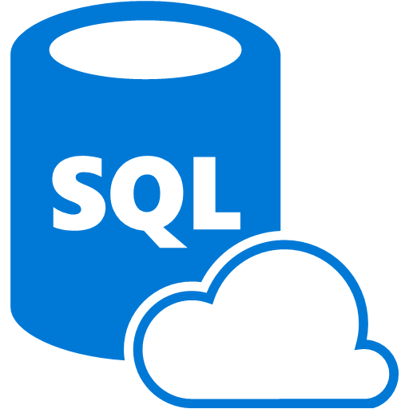

# ReelCAT Flask Webservice Backend

> Setup for backend services of Xamarin.Forms app.

## 🏠 [Main Repository](https://github.com/microsoft/recommenders)

# Contents

- [ReelCAT Flask Webservice Backend](#reelcat-flask-webservice-backend)
  - [🏠 Main Repository](#%f0%9f%8f%a0-main-repository)
- [Contents](#contents)
- [Running the Backend Locally](#running-the-backend-locally)
  - [Prerequisites](#prerequisites)
  - [Install](#install)
  - [Setting up ML model endpoint](#setting-up-ml-model-endpoint)
  - [Setting up Azure SQL Database](#setting-up-azure-sql-database)
  - [Setting up Azure Search](#setting-up-azure-search)
  - [Set up config.py](#set-up-configpy)
  - [Usage](#usage)
- [Running the Backend on Azure](#running-the-backend-on-azure)
  - [Prerequisites](#prerequisites-1)
  - [Setting up Azure Container Registry](#setting-up-azure-container-registry)
    - [Log into a registry](#log-into-a-registry)
  - [Setting up Azure Kubernetes Services](#setting-up-azure-kubernetes-services)
    - [Install AKS CLI](#install-aks-cli)
    - [Create an AKS cluster](#create-an-aks-cluster)
    - [Getting AKS cluster configuration](#getting-aks-cluster-configuration)
  - [Building the Docker file](#building-the-docker-file)
  - [Pushing to Azure Container Registry](#pushing-to-azure-container-registry)
  - [Setting up app.yaml file](#setting-up-appyaml-file)
    - [Naming](#naming)
    - [Secrets](#secrets)
    - [Backend IP](#backend-ip)
    - [Azure Container Registry](#azure-container-registry)
  - [Grant AKS Permission to ACR](#grant-aks-permission-to-acr)
  - [Deploying to AKS](#deploying-to-aks)
- [API Documentation](#api-documentation)

# Running the Backend Locally

Note: It's recommended to create all the following Azure services under the same resource group to organize all the services together.

## Prerequisites

- python >= 3.7
- [pip](https://pip.pypa.io/en/stable/installing/)
- config.py file with secrets
- ML model endpoint
- [tmdb API key](https://developers.themoviedb.org/3)
  
  

  You can obain a tmdb API key for free as an open source developer using the above link.

- [Azure SQL Database](https://azure.microsoft.com/en-us/pricing/details/sql-database/single/)

  

- [Azure Search](https://azure.microsoft.com/en-us/services/search/)

  

## Install

```sh
pip install -r requirements.txt
```

## Setting up ML model endpoint

Run the desired jupyter notebook (either [SAR](../../../notebooks/05_operationalize/sar_webservice_poc.ipynb) or [Light GBM](../../../notebooks/05_operationalize/lgbm_webservice_poc.ipynb)) and write down the REST url endpoint and the Bearer token returned at the end of the notebook by the following cell:

```python
if service.compute_type == 'AKS':
    url = service.scoring_uri

    # Setup authentication using one of the keys from service
    headers = dict(Authorization='Bearer {}'.format(service.get_keys()[0]))
else:
    url = 'http://localhost:8889/score'
    headers = None

print(headers)
print('Service URI: {}'.format(url))
```

The REST url endpoint [SAR_MODEL_ENDPOINT](#set-up-configpy) and Bearer token [SAR_BEARER_TOKEN](#set-up-configpy) will be needed in the config.py file.

## Setting up Azure SQL Database

Set up a single SQL database through the Azure Portal. The database will be storing the movielens dataset. In the database resource, head to **Properties** and then **show database connection strings** and finally click on **ODBC**. This string will give the necessary properties for the [config file](#set-up-configpy):

```sh
Driver={ODBC Driver 17 for SQL Server};Server=tcp:DATABASE_SERVER.database.windows.net,1433;Database=DATABASE_NAME;Uid=ADMIN_USERNAME@DATABASE_SERVER;Pwd=ADMIN_PASSWORD;Encrypt=yes;TrustServerCertificate=no;Connection Timeout=30;
```

See [DATABASE_README.md](./../../data/DATABASE_README.md) for more details.

## Setting up Azure Search

Once your SQL database is set up, it should be connected with Azure Search to support powerful search capabilities.

1. Create a new Azure Search service from the Azure Portal
2. Head to your database in Azure Portal
3. Under the **Settings** subtitle, click on **Add Azure Search**
4. **Select a Search Service**: choose the Search Service you  just created
5. **Connect your Data**: choose the database with the movielens dataset and put in required credentials
6. **Customize Target Indexer**: make sure all field names are checked for retrievable and searchable and choose genre and year for filterable and sortable.
7. **Create an Indexer**: choose how often you want to indexer to run (i.e. how often the database will update). Once will suffice unless you plan on updating the movielens dataset in the database.

Once Azure Search is set up, obtain the search url and place it in config.py.

## Set up config.py

```python
# Obtain these from the sar_webservice_poc and lgbm_webservice_pos notebook linked in the recommenders repository
sar_url = SAR_MODEL_ENDPOINT
sar_token = SAR_BEARER_TOKEN
lgbm_url = LGBM_MODEL_ENDPOINT
lgbm_token = LGBM_BEARER_TOKEN

# Obtain these from the "Setting up Azure SQL Database" step
server = DATABASE_SERVER
database = DATABASE_NAME
username = ADMIN_USERNAME
password = ADMIN_PASSWORD
driver = '{ODBC Driver 17 for SQL Server}'

# Obtain the API key from the tmdb website listed in the prerequisites
tmdb_key = TMDB_API_KEY

# Obtain from the "Setting up Azure Search" step
search_url = SEARCH_URL
```

Place the config.py file in the root backend directory. The backend set up is now finished.

## Usage

```sh
python3 -m flask run
```

The backend API service should now be running on <http://localhost:5000>. See API.md for detailed documentation on available endpoints.

# Running the Backend on Azure

Note: Use the same Azure resource group as the previous Azure services.

## Prerequisites

- Install [Docker](https://docs.docker.com/install/)

  

- Install [Azure CLI](https://docs.microsoft.com/en-us/cli/azure/install-azure-cli?view=azure-cli-latest)
  
- [Azure Kubernetes Services](https://azure.microsoft.com/en-us/services/kubernetes-service/)

  

- [Azure Container Registry](https://azure.microsoft.com/en-us/services/container-registry/)

  

## Setting up Azure Container Registry

First create an Azure Container Registry resource either on Azure Portal or through command line and keep track of the registry name when created.

```sh
az acr create --name REGISTRY_NAME --resource-group RESOURCE_GROUP --sku Basic
```

More info [here](https://docs.microsoft.com/en-us/azure/container-registry/container-registry-get-started-azure-cli).

### Log into a registry

```sh
az acr login --name REGISTRY_NAME
```

Alternatively:

```sh
docker login REGISTRY_NAME.azurecr.io
```

When prompted to log in, head over to **Access Keys** in the container registry resource, **enable Admin user** to obtain login credentials.

More info [here](https://docs.microsoft.com/en-us/azure/container-registry/container-registry-get-started-azure-cli).

## Setting up Azure Kubernetes Services

### Install AKS CLI

```sh
az aks install-cli
```

### Create an AKS cluster

Use the same AKS cluster as the one created by AzureML and skip the following step. If another is need, then it can be created either through Azure Portal or through command line:

```sh
az aks create -g RESOURCE_GROUP_NAME -n CLUSTER_NAME -location eastus
```

### Getting AKS cluster configuration

```sh
az aks get-credentials --resource-group RESOURCE_GROUP_NAME --name CLUSTER_NAME
```

## Building the Docker file

```sh
docker build -f Dockerfile -t IMAGE_NAME .
```

## Pushing to Azure Container Registry

```sh
docker tag IMAGE_NAME REGISTRY_NAME.azurecr.io/IMAGE_NAME:v1
docker push REGISTRY_NAME.azurecr.io/IMAGE_NAME
```

More info [here](https://docs.microsoft.com/en-us/azure/container-registry/container-registry-get-started-azure-cli). If you run into issues with ACR not being authorized to access AKS, then follow the instructions in [this](https://docs.microsoft.com/en-us/azure/container-registry/container-registry-auth-aks
) article.

If you want to test the container locally before deploying to AKS:

```sh
docker run -d -p 5000:5000 REGISTRY_NAME.azurecr.io/IMAGE_NAME:latest
```

It should then be running on <http://localhost:5000.>

## Setting up app.yaml file

### Naming

Replace all the `name` and `app` fields with the name of your app.

### Secrets

First, inject the config.py file to AKS as a secret file so that the contents remain encrypted. Run the following command in the root directory of the backend folder:

```sh
kubectl create secret generic SECRET_NAME --from-file=config=PATH_TO_FILE
```

Note the SECRET_NAME and place it under the `secretName` field in the app.yaml file.

### Backend IP

Choose an IP address that you want the backend to be running on once it is deployed to AKS and place it under the `loadBalancerIP` field.

See [here](https://kubernetes.io/docs/concepts/services-networking/service/#loadbalancer) for more info.

### Azure Container Registry

Replace the **image** field with the full url to the image on ACR from the previous steps.

## Grant AKS Permission to ACR

See [this](https://docs.microsoft.com/en-us/azure/container-registry/container-registry-auth-aks) article to grant your AKS cluster permission to access the container from ACR.

## Deploying to AKS

Using the app.yaml file, we deploy the backend to AKS.

```sh
kubectl apply -f app.yaml
```

Check if is is running with:

```sh
kubectl get pods
```

To check logs for any errors:

```
kubectl logs POD_ID
```

# API Documentation

https://documenter.getpostman.com/view/2943927/SVfH1YMG