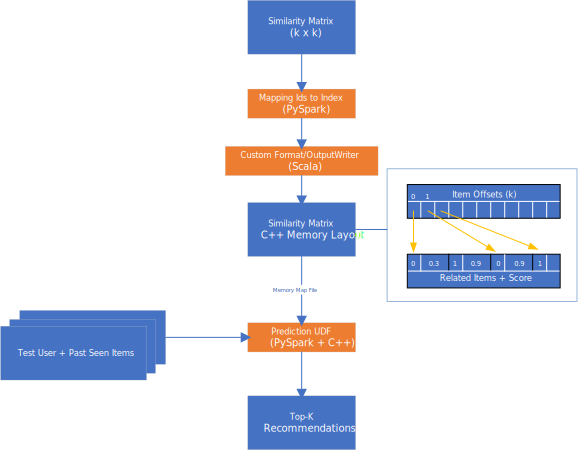

# SAR PySpark/C++ backed implementation

Features
* Scalable PySpark based [implementation](python/pysarplus/SARPlus.py)
* Fast C++ based [predictions](python/src/pysarplus.cpp)
* Reduced memory consumption: similarity matrix cached in-memory once per worker, shared accross python executors 

# Installation

## Local Machine
Run 

```bash
cd python
python setup.py install

cd ../scala
sbt package
```

Reference the produced scala package in PySpark using spark.jars

## Databricks

As databricks doesn't allow C++ code to be compiled on demand, one must publish a pypi package and then reference it.
Please follow the "packaging" guide below on how to release a pypi package. 

# Top-K Recommendation Optimization

There are a couple of key optimizations:

* map item ids (e.g. strings) to a continuous set of indexes to optmize storage and simplify access
* convert similarity matrix to exactly the representation the C++ component needs, thus enabling simple shared, memory mapping of the cache file and avoid parsing. This requires a customer formatter, written in Scala
* shared read-only memory mapping allows us to re-use the same memory from multiple python executors on the same worker node
* partition the input test users and past seen items by users, allowing for scale out
* perform as much of the work as possible in PySpark (way simpler)
* top-k computation
** reverse the join by summing reverse joining the users past seen items with any related items
** make sure to always just keep top-k items in-memory
** use standard join using binary search between users past seen items and the related items

 

# Usage

```python
import pandas as pd
from pysarplus import SARPlus

# spark dataframe with user/item/rating/optional timestamp tuples
train_df = spark.createDataFrame(
      pd.DataFrame({
        'user_id': [1, 1, 2, 3, 3],
        'item_id': [1, 2, 1, 1, 3],
        'rating':  [1, 1, 1, 1, 1],
    }))
   
# spark dataframe with user/item tuples
test_df = spark.createDataFrame(
      pd.DataFrame({
        'user_id': [1, 3],
        'item_id': [1, 3],
        'rating':  [1, 1],
    }))
    
model = SARPlus(spark, col_user='user_id', col_item='item_id', col_rating='rating', col_timestamp='timestamp')
model.fit(train_df, similarity_type='jaccard')


model.recommend_k_items(test_df, 'sarplus_cache', top_k=3).show()

# For databricks
# model.recommend_k_items(test_df, 'dbfs:/mnt/sarpluscache', top_k=3).show()
```

## Jupyter Notebook

Insert this cell prior to the code above.

```python
import os

SUBMIT_ARGS = "--packages your_alias:sarplus:0.2.2 pyspark-shell"
os.environ["PYSPARK_SUBMIT_ARGS"] = SUBMIT_ARGS

from pyspark.sql import SparkSession

spark = (
    SparkSession.builder.appName("sample")
    .master("local[*]")
    .config("memory", "1G")
    .config("spark.sql.shuffle.partitions", "1")
    .config("spark.sql.crossJoin.enabled", True)
    .config("spark.ui.enabled", False)
    .getOrCreate()
)
```

## PySpark Shell

```bash
pip install pysarplus
pyspark --packages your_alias:sarplus:0.2.2 --conf spark.sql.crossJoin.enabled=true
```

## Databricks

One must set the crossJoin property to enable calculation of the similarity matrix (Clusters / &lt; Cluster &gt; / Configuration / Spark Config)

```
spark.sql.crossJoin.enabled true
```

1. Navigate to your workspace 
2. Create library
3. Under 'Source' select 'Maven Coordinate'
4. Enter 'your_alias:sarplus:0.2.2'
5. Hit 'Create Library'
6. Attach to your cluster
7. Create 2nd library
8. Under 'Source' select 'Upload Python Egg or PyPI'
9. Enter 'pysarplus'
10. Hit 'Create Library'
11. Enter 'pysarplus'

This will install C++, Python and Scala code on your cluster.

You'll also have to mount shared storage

1. Create [Azure Storage Blob](https://ms.portal.azure.com/#create/Microsoft.StorageAccount-ARM)
2. Create storage account (e.g. <yourcontainer>)
3. Create container (e.g. sarpluscache)

1. Navigate to User / User Settings
2. Generate new token: enter 'sarplus'
3. Use databricks shell (installation here)
4. databricks configure --token
4.1. Host: e.g. https://westus.azuredatabricks.net
5. databricks secrets create-scope --scope all --initial-manage-principal users
6. databricks secrets put --scope all --key sarpluscache
6.1. enter Azure Storage Blob key of Azure Storage created before
7. Run mount code


```pyspark
dbutils.fs.mount(
  source = "wasbs://sarpluscache@<yourcontainer>.blob.core.windows.net",
  mount_point = "/mnt/sarpluscache",
  extra_configs = {"fs.azure.account.key.<yourcontainer>.blob.core.windows.net":dbutils.secrets.get(scope = "all", key = "sarpluscache")})
```


# Packaging

For [databricks](https://databricks.com/) to properly install a [C++ extension](https://docs.python.org/3/extending/building.html), one must take a detour through [pypi](https://pypi.org/).
Use [twine](https://github.com/pypa/twine) to upload the package to [pypi](https://pypi.org/).

```bash
cd python

python setup.py sdist

twine upload dist/pysarplus-*.tar.gz
```

On [Spark](https://spark.apache.org/) one can install all 3 components (C++, Python, Scala) in one pass by creating a [Spark Package](https://spark-packages.org/). Documentation is rather sparse. Steps to install

1. Package and publish the [pip package](python/setup.py) (see above)
2. Package the [Spark package](scala/build.sbt), which includes the [Scala formatter](scala/src/main/scala/your_alias/sarplus) and references the [pip package](scala/python/requirements.txt) (see below)
3. Upload the zipped Scala package to [Spark Package](https://spark-packages.org/) through a browser. [sbt spPublish](https://github.com/databricks/sbt-spark-package) has a few [issues](https://github.com/databricks/sbt-spark-package/issues/31) so it always fails for me. Don't use spPublishLocal as the packages are not created properly (names don't match up, [issue](https://github.com/databricks/sbt-spark-package/issues/17)) and furthermore fail to install if published to [Spark-Packages.org](https://spark-packages.org/).  

```bash
cd scala
sbt spPublish
```

# Testing

To test the python UDF + C++ backend

```bash
cd python 
python setup.py install && pytest -s tests/
```

To test the Scala formatter

```bash
cd scala
sbt test
```

(use ~test and it will automatically check for changes in source files, but not build.sbt)

