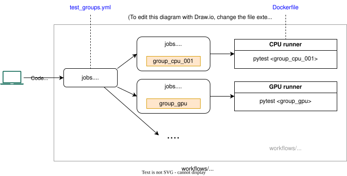

<!--
Copyright (c) Recommenders contributors.
Licensed under the MIT License.
-->

# Tests

Recommenders test pipeline is one of the most sophisticated MLOps
pipelines in the open-source community.  We execute tests in the three
environments we support: CPU, GPU, and Spark, mirroring the tests in
each Python version we support.  We test not only the library, but
also the Jupyter notebooks in the examples folder.

The reason to have this extensive test infrastructure is to ensure that the code is reproducible by the community and that we can maintain the project with a small number of core contributors.

We currently execute over a thousand tests in the project, and we are always looking for ways to improve the test coverage. To get the exact number of tests, you can run `pytest tests --collect-only`, and then multiply the number of tests by the number of Python versions we support.

In this document we show our test infrastructure and how to contribute tests to the repository.

## Table of Contents

- [Test workflows](#test-workflows)
- [Categories of tests](#categories-of-tests)
- [Scalable test infrastructure with GitHub Actions](#scalable-test-infrastructure-with-github-actions)
- [How to contribute tests to the repository](#how-to-contribute-tests-to-the-repository)
    - [How to create tests for the Recommenders library](#how-to-create-tests-for-the-recommenders-library)
    - [How to create tests for the notebooks](#how-to-create-tests-for-the-notebooks)
    - [How to add tests to the GitHub workflows](#How-to-add-tests-to-the-GitHub-workflows)
- [How to set up the testing infrastructure](#how-to-set-up-the-testing-infrastructure)
    - [Use self-hosted runners](#use-self-hosted-runners)
    - [Use VMs from Compshare](#use-vms-from-compshare)
    - [Use VMs from Alibaba Cloud](#use-vms-from-alibaba-cloud)
- [How to add a new cloud servive for the testing infrastructure](#how-to-add-a-new-cloud-servive-for-the-testing-infrastructure)
- [How to execute tests in your local environment](#how-to-execute-tests-in-your-local-environment)


## Test workflows

All the tests in this repository are part of the following two workflows: the PR gate and the nightly builds.

**PR gates** are the set of tests executed after doing a pull request and they should be quick. The objective is to validate that the code is not breaking anything before merging it. The PR gate should not surpass 20-30 minutes.

The **nightly builds** are tests executed asynchronously and can take hours. Some tests take so long that they cannot be executed in a PR gate, therefore they are executed asynchronously in the nightly builds. 

Notice that the errors in the nightly builds are detected after the code has been merged. This is the reason why, with nightly builds, it is interesting to have a two-level branching strategy. In the standard one-level branching strategy, all pull requests go to the main branch. If a nightly build fails, then the main branch has broken code. In the two-level branching strategy, a pre-production or staging branch is where developers send pull requests to. The main branch is only updated from the staging branch after the nightly builds are successful. This way, the main branch always has working code.

## Categories of tests

The tests in this repository are divided into the following categories:

* **Data validation tests:** In the data validation tests, we ensure that the schema for input and output data for each function in the pipeline matches the desired prespecified schema, that the data is available and has the correct size. They should be fast and can be added to the PR gate.
* **Unit tests**: In the unit tests we just make sure the python utilities and notebooks run correctly. Unit tests are fast, ideally less than 5min and are run in every pull request. They belong to the PR gate. For this type of tests, synthetic data can be used.
* **Functional tests:** These tests make sure that the components of the project not just run but their function is correct. For example, we want to test that an ML model evaluation of RMSE gives a positive number. These tests can be run asynchronously in the nightly builds and can take hours. In these tests, we want to use real data.
* **Integration tests:** We want to make sure that the interaction between different components is correct. For example, the interaction between data ingestion pipelines and the compute where the model is trained, or between the compute and a database. These tests can be of variable length, if they are fast, we could add them to the PR gate, otherwise, we will add them to the nightly builds. For this type of tests, synthetic and real data can be used.
* **Smoke tests:** The smoke tests are gates to the slow tests in the nightly builds to detect quick errors. If we are running a test with a large dataset that takes 4h, we want to create a faster version of the large test (maybe with a small percentage of the dataset or with 1 epoch) to ensure that it runs end-to-end without obvious failures. Smoke tests can run sequentially with functional or integration tests in the nightly builds, and should be fast, ideally less than 20min. They use the same type of data as their longer counterparts.
* **Performance test:** The performance tests are tests that measure the computation time or memory footprint of a piece of code and make sure that this is bounded between some limits. Another kind of performance testing can be a load test to measure an API response time, this can be specially useful when working with large deep learning models. For this type of tests, synthetic data can be used.
* **Responsible AI tests:** Responsible AI tests are test that enforce fairness, transparency, explainability, human-centeredness, and privacy.
* **Security tests:** Security tests are tests that make sure that the code is not vulnerable to attacks. These can detect potential security issues either in python packages or the underlying OS, in addition to scheduled scans in the production pipelines.
* **Regression tests:** In some situations, we are migrating from a deprecated version to a new version of the code, or maybe we are maintaining two versions of the same library (i.e. Tensorflow v1 and v2). Regression tests make sure that the code works in both versions of the code. These types of tests sometimes are done locally, before upgrading to the new version, or they can be included in the tests pipelines if we want to execute them recurrently.

For more information, see a [quick introduction testing](https://miguelgfierro.com/blog/2018/a-beginners-guide-to-python-testing/).


## Scalable test infrastructure with GitHub Actions

GitHub Actions is used to run the existing unit, smoke and integration
tests.  GitHub Actions benefits include being able to run the tests in
parallel, and automatic logging of artifacts from test runs and more.

How the tests are executed via GitHub Actions is shown in the
following diagram:



Tests of different categories are run in the 4 GitHub workflows
defined under [.github/workflows/](../.github/workflows/) where the
tests are divided into groups and each workflow triggers these test
groups in parallel, which significantly reduces end-to-end execution
time:
* [`unit-tests.yml`](../.github/workflows/unit-tests.yml)
* [`cpu-nightly.yml`](../.github/workflows/cpu-nightly.yml)
* [`gpu-nightly.yml`](../.github/workflows/gpu-nightly.yml)
* [`spark-nightly.yml`](../.github/workflows/spark-nightly.yml)

These workflows are composed of:
* one [reusable workflow](https://docs.github.com/en/actions/reference/workflows-and-actions/reusing-workflow-configurations):
  [`template.yml`](../.github/workflows/template.yml)
  + It is used by the 4 workflows configured for different compute
    environments and test categories.
  + The [repository
    variable](https://github.com/recommenders-team/recommenders/settings/variables/actions)
    `CLOUD_SERVICE` can be used to select a cloud service to run the
    tests.
    - Setting `CLOUD_SERVICE` to `alicloud` or `compshare` runs the
      tests on VMs created on demand by [Alibaba
      Cloud](https://www.alibabacloud.com) or [UCloud
      CompShare](https://www.compshare.cn) respectively.
    - Settng `CLOUD_SERVICE` to `self-hosted` runs the tests on
      pre-allocated VMs set up as [GitHub Actions self-hosted
      runners](https://docs.github.com/en/actions/concepts/runners/self-hosted-runners).
  + It includes 2 jobs:
    - `get-test-groups` extracts test groups collected in the
      configuration file [`test_groups.yml`](./test_groups.yml) to run
      parallelly in the workflows.
    - `execute-tests` runs one test group output from
      `get-test-groups` in a Docker container with appropriate
      environment set up in the
      [`Dockerfile`](../tools/docker/Dockerfile).  More details on
      Docker support can be found at
      [tools/docker/README.md](../tools/docker/README.md).
* one configuration file: [`test_groups.yml`](./test_groups.yml)
  + It defines the groups of tests.
    - If the tests are part of the unit tests, the total compute time
      of each group should be less than 15min.
    - If the tests are part of the nightly builds, the total time of
      each group should be less than 35min.


## How to contribute tests to the repository

In this section we show how to create tests and add them to the test pipeline. The steps you need to follow are:

1. Create your code in the library and/or notebooks.
1. Design the unit tests for the code.
1. If you have written a notebook, design the notebook tests and check that the metrics they return is what you expect.
1. Add the tests to the GitHub workflows in the corresponding [test
   group](./test_groups.yml).

**Please note that if you don't add your tests to the workflows, they
will not be executed.**


### How to create tests for the Recommenders library

You want to make sure that all your code works before you submit it to the repository. Here are some guidelines for creating the tests:

* It is better to create multiple small tests than one large test that checks all the code.
* Use `@pytest.fixture` to create data in your tests.
* Follow the pattern `assert computation == value`, for example:
```python
assert results["precision"] == pytest.approx(0.330753)
```
* Check always the limits of your computations, for example, you want to check that the RMSE between two equal vectors is 0:
```python
assert rmse(rating_true, rating_true) == 0
assert rmse(rating_true, rating_pred) == pytest.approx(7.254309)
```
* Use the operator `==` with values. Use the operator `is` in singletons like `None`, `True` or `False`.
* Make explicit asserts. In other words, make sure you assert to something (`assert computation == value`) and not just `assert computation`.
* Use the mark `@pytest.mark.gpu` if you want the test to be executed in a GPU environment. Use `@pytest.mark.spark` if you want the test to be executed in a Spark environment.
* Use `@pytest.mark.notebooks` if you are testing a notebook.


### How to create tests for the notebooks

For testing the notebooks of this repo, we developed the Recommenders notebook executor, that enables you to parametrize and execute notebooks for testing. 

The notebook executor is located in [recommenders/utils/notebook_utils.py](../recommenders/utils/notebook_utils.py). The main functions are:

* `execute_notebook`: Executes a notebook and saves the output in a new notebook. Optionally, you can inject parameters to the notebook. For that, you need to tag the cells with the tag `parameters`. Every cell tagged with `parameters` can be injected with the variables passed in the `parameters` dictionary.
* `store_metadata`: Stores the output of a variable. The output is stored in the metadata of the Jupyter notebook and can be read by `read_notebook` function.
* `read_notebook`: Reads the output notebook and returns a dictionary with the variables recorded with `store_metadata`.


#### Developing PR gate tests with the notebook executor

Executing a notebook with the Recommenders notebook executor is easy, this is what we mostly do in the unit tests. Next, we show just one of the tests that we have in [tests/unit/examples/test_notebooks_python.py](unit/examples/test_notebooks_python.py).

```python
import pytest
from recommenders.utils.notebook_utils import execute_notebook

@pytest.mark.notebooks
def test_sar_single_node_runs(notebooks, output_notebook, kernel_name):
    notebook_path = notebooks["sar_single_node"]
    execute_notebook(notebook_path, output_notebook, kernel_name=kernel_name)
```

Notice that the input of the function is a fixture defined in [conftest.py](conftest.py). For more information, please see the [definition of fixtures in PyTest](https://docs.pytest.org/en/latest/fixture.html).

For executing this test, first make sure you are in the correct environment as described in the [SETUP.md](../SETUP.md): 

*Notice that the next instruction executes the tests from the root folder.*

```bash
pytest tests/unit/examples/test_notebooks_python.py::test_sar_single_node_runs
```

#### Developing nightly tests with the notebook executor

A more advanced option is used in the nightly tests, where we not only execute the notebook, but inject parameters and recover the computed metrics.

The first step is to tag the parameters that we are going to inject. For it we need to modify the notebook. We will add a tag with the name `parameters`. To add a tag, go the notebook menu, View, Cell Toolbar and Tags. A tag field will appear on every cell. The variables in the cell tagged with `parameters` can be injected. The typical variables that we inject are `MOVIELENS_DATA_SIZE`, `EPOCHS` and other configuration variables for our algorithms.

The way the notebook executor works to inject parameters is very simple, it generates a copy of the notebook (in our code we call it `OUTPUT_NOTEBOOK`), and replaces the cell with the tag `parameters` with the injected variables.

The second modification that we need to do to the notebook is to record the metrics we want to test using `store_metadata("output_variable", python_variable_name)`. We normally use the last cell of the notebook to record all the metrics. These are the metrics that we are going to control in the smoke and functional tests.

This is an example on how we do a smoke test. The complete code can be found in [smoke/examples/test_notebooks_python.py](./smoke/examples/test_notebooks_python.py):

```python
import pytest

from recommenders.utils.notebook_utils import execute_notebook, read_notebook

TOL = 0.05
ABS_TOL = 0.05

def test_sar_single_node_smoke(notebooks, output_notebook, kernel_name):
    notebook_path = notebooks["sar_single_node"]
    execute_notebook(
        notebook_path,
        output_notebook,
        kernel_name=kernel_name,
        parameters=dict(TOP_K=10, MOVIELENS_DATA_SIZE="100k"),
    )
    results = read_notebook(output_notebook)
    
    assert results["precision"] == pytest.approx(0.330753, rel=TOL, abs=ABS_TOL)
    assert results["recall"] == pytest.approx(0.176385, rel=TOL, abs=ABS_TOL)
```

As it can be seen in the code, we are injecting the dataset size and the top k and we are recovering the precision and recall at k. 

For executing this test, first make sure you are in the correct environment as described in the [SETUP.md](../SETUP.md): 

*Notice that the next instructions execute the tests from the root folder.*

```
pytest tests/smoke/examples/test_notebooks_python.py::test_sar_single_node_smoke
```

### How to add tests to the GitHub workflows

To add a new test to the GitHub workflows, add the test path to an
appropriate test group listed in [test_groups.yml](./test_groups.yml).

Tests in `group_cpu_xxx` groups are executed on a CPU-only GitHub
compute node.  Tests in `group_gpu_xxx` groups are executed on a
GPU-enabled compute node with GPU related dependencies added to the
environment.  Tests in `group_pyspark_xxx` groups are executed on a
CPU-only compute node, with the PySpark related dependencies added to
the environment.

It's important to keep in mind while adding a new test that the
runtime of the test group should not exceed the specified threshold in
[test_groups.yml](./test_groups.yml).

Example of adding a new test:

1. In the environment that you are running your code, first see if there is a group whose total runtime is less than the threshold.

```yaml
group_spark_001: # Total group time: 271.13s
  - tests/data_validation/recommenders/datasets/test_movielens.py::test_load_spark_df  # 4.33s+ 25.58s + 101.99s + 139.23s
```

2. Add the test to the group, add the time it takes to compute, and update the total group time.

```yaml
group_spark_001: [  # Total group time: 571.13s
  -  tests/data_validation/recommenders/datasets/test_movielens.py::test_load_spark_df  # 4.33s+ 25.58s + 101.99s + 139.23s
  -  tests/path/to/test_new.py::test_new_function  # 300s
```

3. If all the groups of your environment are above the threshold, add a new group.


## How to set up the testing infrastructure

As described above, different infrastructures can be used to run the
tests.  In a nutshell,
this requires the following steps:
1. Prepare the cloud services described in the subsections below.
1. Switch to the cloud service by setting [repository
   variable](https://github.com/recommenders-team/recommenders/settings/variables/actions)
   `CLOUD_SERVICE` to the name of the cloud service, such as
   `alicloud`, `compshare` or `self-hosted`.


### Use self-hosted runners

<details>
<summary>Click to see more ...</summary>

In this section we explain how to use self-hosted GitHub Actions
runners to run the tests.

Three types of GitHub Actions runners are used to execute the tests in
Recommenders:
1. free [GitHub-hosted runners](https://docs.github.com/en/actions/reference/runners/github-hosted-runners#standard-github-hosted-runners-for-public-repositories)
   (16GB memory by default), to execute the CPU and Spark tests in PR
   gates.
   * The
     [image](https://github.com/actions/runner-images/blob/main/images/ubuntu/Ubuntu2404-Readme.md)
     for GitHub-hosted runners have everything required installed, so
     we don't have to do extra setup.
   * In addition, for public repositories, GitHub has [usage
     limits](https://docs.github.com/en/actions/reference/limits) for
     GitHub-hosted runners.

1. [self-hosted
   runners](https://docs.github.com/en/actions/reference/runners/self-hosted-runners)
   with GPU to execute the GPU tests, and self-hosted runners without
   GPU but having larger memory (64GB) to execute the nightly CPU
   tests

Follow the steps below to use GitHub-hosted and self-hosted runners:
1. Install the following prerequisites on the VMs.
   * [Docker](https://docs.docker.com/engine/install)
     + Docker daemon should be configured run in [rootless
       mode](https://docs.docker.com/engine/security/rootless/).
   * (For GPU runners) [NVIDIA container toolkit](https://docs.nvidia.com/datacenter/cloud-native/container-toolkit/latest/install-guide.html)
1. Follow the steps described in [Adding self-hosted
   runners](https://docs.github.com/en/actions/how-tos/manage-runners/self-hosted-runners/add-runners)
   to add the VMs as self-hosted runners on GitHub.
   * Currently, we have 2 runner groups.
     + `GPU`, for GPU runners.
     + `CPU`, for CPU runners with larger memory (64GB).
   * However, which runners are identified as GPU runners or CPU
     runners is determined by their labels instead of their runner
     groups.  So we have to label GPU runners as `GPU` and CPU runners
     as `CPU` in the configure step.
1. Schedule Docker build cache cleanup by adding the following entry
   into crontab.
   
   ```
   0 * * * * docker buildx prune -f --min-free-space 80gb
   ```

   * The amount of free space required (`80gb` in the example above)
     can vary depending on the actual specification of the VMs.

1. After preparing the self-hosted runners, assign `self-hosted` to
   the [repository
   variable](https://github.com/recommenders-team/recommenders/settings/variables/actions)
   `CLOUD_SERVICE`.

</details>


### Use VMs from Compshare

<details>
<summary>Click to see more ...</summary>

In this section we explain how to run the tests on VMs created on
demand by the [CompShare](https://www.compshare.cn) cloud service.
1. Log into [Compshare console](https://passport.compshare.cn/login).
1. Create API keys (one API private key and one API public key) for
   the shell scripts under
   [`.github/workflows/tools/compshare/`](../.github/workflows/tools/compshare/)
   to interact with the CompShare APIs.
1. (**Optional**) Create a VM as pull-through caches/mirrors for
   Docker, PyPI index and HTTP/HTTPS proxy by using any possible
   tools, such as
   * [devpi-server](https://pypi.org/project/devpi-server/) for
     caching PyPI index,
   * [Distribution
     Registry](https://distribution.github.io/distribution/) for
     caching Docker Hub,
   * [Squid](https://www.squid-cache.org/) for other HTTP/HTTPS
     requests.
1. Assign the value of the **API private key** to the [repository
   secret](https://github.com/recommenders-team/recommenders/settings/secrets/actions)
   `CLOUD_SERVICE_SECRET`.

   **NOTE**: By default, secrets are not passed to workflows triggered
   by the
   [`pull_request`](https://docs.github.com/en/actions/reference/workflows-and-actions/events-that-trigger-workflows#pull_request)
   event from forked repositories according to [the
   doc](https://docs.github.com/en/actions/reference/workflows-and-actions/events-that-trigger-workflows#workflows-in-forked-repositories). So
   we use the
   [`pull_request_target`](https://docs.github.com/en/actions/reference/workflows-and-actions/events-that-trigger-workflows#pull_request_target)
   event to trigger PR gates.
   * If there are any changes to the infrastructure that modifies the
     workflow for PR gates (i.e., changes made into
     [`./github/workflows/`](../.github/workflows/)), they should be
     merged into the `main` branch to take effect.
   * Other changes not related to the infrastructure, such as changes
     made into [`recommenders/`](../recommenders/),
     [`tests/`](../tests/), and [`examples`](../examples/), can take
     effect immediately in PR gates without having to merge into
     `main`.
1. Populate the [repository
   variable](https://github.com/recommenders-team/recommenders/settings/variables/actions)
   `CLOUD_SERVICE_ENVS` with the following keys in JSON format.  For
   example:

   ```json
   {
       "COMPSHARE_PUBLIC_KEY": "4eZDWALVcX98NZMdRMC6xXFgwDWRTpLA3",
       "VM_DOCKER_MIRROR_URL": "http://10.60.204.164:5000",
       "VM_HTTP_PROXY": "http://10.60.204.164:3128",
       "VM_HTTPS_PROXY": "http://10.60.204.164:4128",
       "VM_PIP_INDEX_URL": "http://10.60.204.164:3141/root/pypi",
       "VM_PROXY_CERTIFICATE": "-----BEGIN CERTIFICATE-----\nMII...XMo\n-----END CERTIFICATE-----"
   }
   ```

   * For the CompShare **API public key**
     + Name: `COMPSHARE_PUBLIC_KEY`
     + Value: value of the API public key
   * (**Optional**) For Docker Hub
     + Name: `VM_DOCKER_MIRROR_URL`
     + Value: URL of the Docker Hub mirror
   * (**Optional**) For HTTP proxy
     + Name: `VM_HTTP_PROXY`
     + Value: URL of the HTTP proxy
   * (**Optional**) For HTTPS proxy
     + Name: `VM_HTTPS_PROXY`
     + Value: URL of the HTTPS proxy
   * (**Optional**) For PyPI index
     + Name: `VM_PIP_INDEX_URL`
     + Value: URL of the PyPI index mirror
   * (**Optional**) For HTTPS proxy CA certificate
     + Name: `VM_PROXY_CERTIFICATE`
     + Value: content of the certificate
1. Assign `compshare` to the [repository
   variable](https://github.com/recommenders-team/recommenders/settings/variables/actions)
   `CLOUD_SERVICE`.

</details>


### Use VMs from Alibaba Cloud

<details>
<summary>Click to see more ...</summary>

In this section we explain how to run the tests on VMs created on
demand by the [Alibaba Cloud](https://www.alibabacloud.com) service.
1. Log into [Alibaba
   Cloud](https://account.alibabacloud.com/login/login.htm).
1. Create an access key for the
   [Terraform](https://developer.hashicorp.com/terraform)
   configurations under
   [`.github/workflows/tools/alicloud/tf`](../.github/workflows/tools/alicloud/tf)
   to interact with the Alibaba Cloud APIs.
   1. Go to Workbench $\to$ Migration and O&M Management $\to$
      Resource Access Management $\to$ Identities $\to$ Users $\to$
      Create User
   1. Click the new user $\to$ Permissions $\to$ Individual $\to$
      Grant Permission, and select the policy "PowerUserAccess".
   1. Click the new user $\to$ Credential $\to$ AccessKey $\to$ Create
      AccessKey $\to$ CLI, and note down the AccessKey ID and the
      AccessKey Secret for the following steps.
1. Assign the value of the **AccessKey Secret** to the [repository
   secret](https://github.com/recommenders-team/recommenders/settings/secrets/actions)
   `CLOUD_SERVICE_SECRET`.
   
   **NOTE**: By default, secrets are not passed to workflows triggered
   by the
   [`pull_request`](https://docs.github.com/en/actions/reference/workflows-and-actions/events-that-trigger-workflows#pull_request)
   event from forked repositories according to [the
   doc](https://docs.github.com/en/actions/reference/workflows-and-actions/events-that-trigger-workflows#workflows-in-forked-repositories). So
   we use the
   [`pull_request_target`](https://docs.github.com/en/actions/reference/workflows-and-actions/events-that-trigger-workflows#pull_request_target)
   event to trigger PR gates.
   * If there are any changes to the infrastructure that modifies the
     workflow for PR gates (i.e., changes made into
     [`./github/workflows/`](../.github/workflows/)), they should be
     merged into the `main` branch to take effect.
   * Other changes not related to the infrastructure, such as changes
     made into [`recommenders/`](../recommenders/),
     [`tests/`](../tests/), and [`examples`](../examples/), can take
     effect immediately in PR gates without having to merge into
     `main`.
1. Populate the [repository
   variable](https://github.com/recommenders-team/recommenders/settings/variables/actions)
   `CLOUD_SERVICE_ENVS` with the following keys in JSON format.  For
   example:

   ```json
   {
       "ALIBABA_CLOUD_ACCESS_KEY_ID": "LTAI5t7r7gbhcPwzzuFc3SPy"
   }
   ```

   * For the **AccessKey ID**
     + Name: `ALIBABA_CLOUD_ACCESS_KEY_ID`
     + Value: the AccessKey ID
   * (**Optional**) For Docker Hub
     + Name: `VM_DOCKER_MIRROR_URL`
     + Value: URL of the Docker Hub mirror
   * (**Optional**) For HTTP proxy
     + Name: `VM_HTTP_PROXY`
     + Value: URL of the HTTP proxy
   * (**Optional**) For HTTPS proxy
     + Name: `VM_HTTPS_PROXY`
     + Value: URL of the HTTPS proxy
   * (**Optional**) For PyPI index
     + Name: `VM_PIP_INDEX_URL`
     + Value: URL of the PyPI index mirror
   * (**Optional**) For HTTPS proxy CA certificate
     + Name: `VM_PROXY_CERTIFICATE`
     + Value: content of the certificate
     
   **NOTE**: Unlike CompShare, Alibaba Cloud provides VMs in regions
   besides China, so that no mirrors for Docker, PyPI and GitHub are
   needed.  However, mirrors can still be used to speed up the setup
   for VMs, as long as the VMs belong to the region where the mirrors
   are.
1. Set the possible values of input vairables for the Terraform
   configurations via the [repository
   variable](https://github.com/recommenders-team/recommenders/settings/variables/actions)
   `CLOUD_SERVICE_INPUT_VARS` in JSON format.  For example:

   ```json
   {
       "cpu": {
           "instance_type_family": [ "ecs.e" ],
           "region": [
               "ap-southeast-5",
               "ap-northeast-1",
               "eu-central-1",
               "ap-southeast-1",
               "us-east-1"
           ]
       },
       "gpu": {
           "instance_type_family": [
               "ecs.gn8is",
               "ecs.gn7i",
               "ecs.gn6i"
           ],
           "region": [
               "ap-southeast-5",
               "ap-northeast-1",
               "eu-central-1",
               "ap-southeast-1",
               "us-east-1"
           ]
       }
   }
   ```

   More details can be found at
   * [`.github/workflows/tools/create.sh`](../.github/workflows/tools/create.sh)
     for how to set `CLOUD_SERVICE_INPUT_VARS`
   * [`.github/workflows/tools/alicloud/tf/variables.tf`](../.github/workflows/tools/alicloud/tf/variables.tf)
     for what input variables to set.
1. Assign `alicloud` to the [repository
   variable](https://github.com/recommenders-team/recommenders/settings/variables/actions)
   `CLOUD_SERVICE`.

</details>


## How to add a new cloud servive for the testing infrastructure

<details>
<summary>Click to see more ...</summary>

This section describes the general structure and principle of adding a
new cloud service for the testing infrastructure.

Since [Terraform](https://developer.hashicorp.com/terraform) provides
a unified and declarative way to provision the infrastructure and is
supported by most cloud services, it is preferable to use
Terraform-support cloud services.  But Non-Terraform support services
can still be used in the testing infrastructure as long as the tools
added follow the structure described below.

As described above, we make several assumptions about how to use the
infrastructure.  Before talking about those assumptions, we give an
overview of the directory
[`.github/workflows/tools`](../.github/workflows/tools) containing
tools used in the workflows.
* Commonly used tools are under `.github/workflows/tools`
  directly.
  + `create.sh`
    - It creates a VM from the specified cloud service using the
      Terraform configurations in the directory named after the
      service, called **the service directory**, like
      `.github/workflows/tools/alicloud`.
    - For non-Terraform-support services like CompShare, another
      `create.sh` is used under its service directory like
      `.github/workflows/tools/compshare/create.sh`.
  + `post_create.sh`
    - It performs post-create setup on the VM, such as system setup,
      installation of Docker and NVIDIA tools.
  + `build_image.sh`
    - It builds the Docker image using the
      [`Dockerfile`](../tools/docker/Dockerfile).
  + `run_tests.sh`
    - It runs the tests in the Docker container.
  + `delete.sh`
    - It cleans up the resources created by `create.sh` using the
      Terraform configurations in the service directory.
    - For non-Terraform-support services like CompShare and ones
      without the need to release the VM, another `delete.sh` is used
      under their sevice directory like
      `.github/workflows/tools/compshare` and
      `.github/workflows/tools/self-hosted`.
* Tools dedicated to specific tasks for different cloud services are
  under their service directory in the following description.
  + For Terraform-support cloud services like Alibaba Cloud, a special
    subdirectory named `tf` under their service directories is used to
    store the Terrform configurations for creating the VM.
  + For non-Terraform-support services like CompShare, scripts are put
    directly under the service directories.
  + Special permanent settings are stored in a file named `config.yml`
    under the service directory.

So tools for the new cloud service should be put into its service
directory under
[`.github/workflows/tools`](../.github/workflows/tools).
* If the cloud service supports
  [Terraform](https://developer.hashicorp.com/terraform), the
  Terraform configurations for creating the VM should be put under a
  direcotry named `tf` in its service directory.  And the Terraform
  configurations
  + **must** accept an input variable called `unique_name` which can
    be used for the name of the VM, Docker image, and other resources.
  + **must** output the following two values for subsequent steps in
    [`template.yml`](../.github/workflows/template.yml) to access to
    the VM.
    - `ssh_dest` for the SSH destination in the format like
      `username@IP_address`.
    - `ssh_key` for the SSH key.
* If the service does not support Terraform, two files with special
  names should be put into its service directory.
  + `create.sh`
    - See the description above for the common tool `create.sh`.
    - It can be omitted if no need.  For example, self-hosted runners
      have already existed, a `create.sh` is not neccessary.
    - It must set the environment variable `SSH_DEST` in the format
      like `username@IP_address` into `$GITHUB_ENV`, so that
      subsequent steps in
      [`template.yml`](../.github/workflows/template.yml) can know
      where the VM is.
  + `delete.sh`
    - See the description above for the common tool `delete.sh`.
* As described above in the sections for how to set up the testing
  infrastructure, several variables or secrets are used to provide
  dynamic settings for those services.
  + `CLOUD_SERVICE`
    - It is used to select which cloud service to use, so the value of
      it should be the name of the service directory.
  + `CLOUD_SERVICE_SECRET`
    - It contains the sensitive setting like the private key or
      acccess token of the cloud service.
  + `CLOUD_SERVICE_ENVS`
    - It contains the insensitive settings in JSON that are dynamic
      but not changed very often, such as the public key, access key
      ID, mirror URLs.
  + `CLOUD_SERVICE_INPUT_VARS`
    - It provides the values for the Terraform input variables, such
      as compute types and regions of the VMs to create, because those
      values are changed very often depending on the costs and the
      availability of the VMs.
* A file named `config.yml` under the service directory is used for
  settings that are permanent for the service.  For example,
  + `apt_mirror`
    - Different cloud servcies may have their own APT mirror for
      downloading system packages.
  + `secret_key_name`
    - The private key or access token stored in `CLOUD_SERVICE_SECRET`
      may need to have a special name for the cloud service APIs to
      recognize when it is being used as an environment variable.
      This setting tells the script to take the value of
      `CLOUD_SERVICE_SECRET` as the value for the key or token.
    - For example, the name of the secret to access Alibaba Cloud APIs
      is `ALIBABA_CLOUD_ACCESS_KEY_SECRET`, and the name of the
      private key for CompShare is `COMPSHARE_PRIVATE_KEY`.

</details>


## How to execute tests in your local environment

To manually execute the tests in the CPU, GPU or Spark environments,
first **make sure you are in the correct environment as described in
the [SETUP.md](../SETUP.md)**.  In addition, [using VS Code together
with Dev containers] for testing is much easier, since VS Code can
detect tests automatically.

### CPU tests

*Note that the next instructions execute the tests from the root folder.*

For executing the CPU tests for the utilities:

    pytest tests -m "not notebooks and not spark and not gpu" --durations 0 --disable-warnings

For executing the CPU tests for the notebooks:

    pytest tests -m "notebooks and not spark and not gpu" --durations 0 --disable-warnings

If you want to execute a specific test, you can use the following command:

    pytest tests/data_validation/recommenders/datasets/test_mind.py::test_mind_url --durations 0 --disable-warnings

If you want to execute any of the tests types (data_validation, unit, smoke, functional, etc.) you can use the following command:

    pytest tests/data_validation -m "not notebooks and not spark and not gpu" --durations 0 --disable-warnings

### GPU tests

For executing the GPU tests for the utilities:

    pytest tests -m "not notebooks and not spark and gpu" --durations 0 --disable-warnings

For executing the GPU tests for the notebooks:

    pytest tests -m "notebooks and not spark and gpu" --durations 0 --disable-warnings

### Spark tests

For executing the PySpark tests for the utilities:

    pytest tests -m "not notebooks and spark and not gpu" --durations 0 --disable-warnings

For executing the PySpark tests for the notebooks:

    pytest tests -m "notebooks and spark and not gpu" --durations 0 --disable-warnings

*NOTE: Adding `--durations 0` shows the computation time of all tests.*

*NOTE: Adding `--disable-warnings` will disable the warning messages.*

In order to skip a test because there is an OS or upstream issue which cannot be resolved you can use pytest [annotations](https://docs.pytest.org/en/latest/skipping.html).

Example:

    @pytest.mark.skip(reason="<INSERT VALID REASON>")
    @pytest.mark.skipif(sys.platform == 'win32', reason="Not implemented on Windows")
    def test_to_skip():
        assert False
